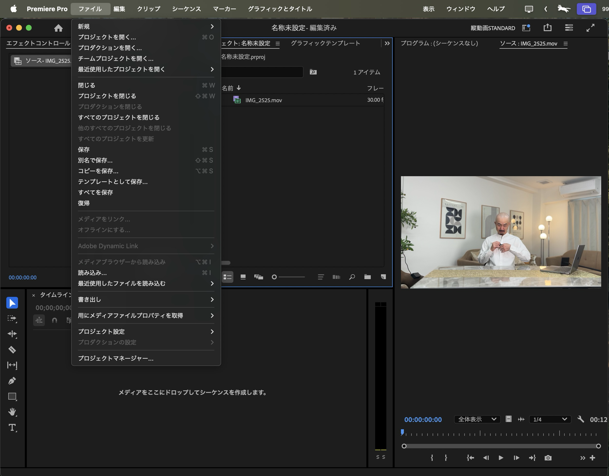
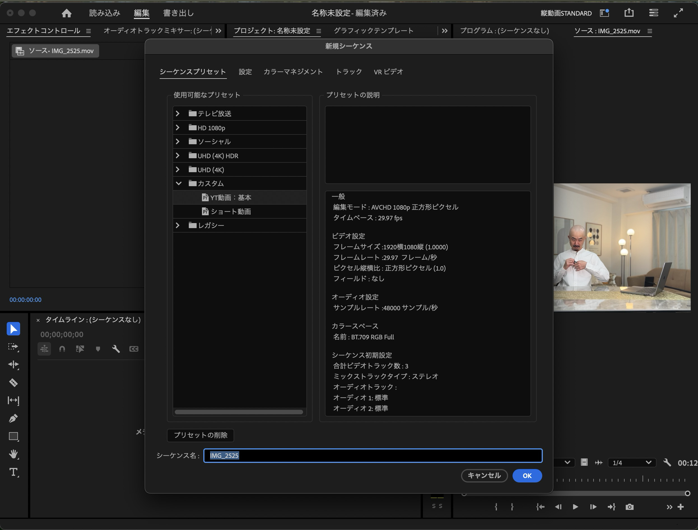
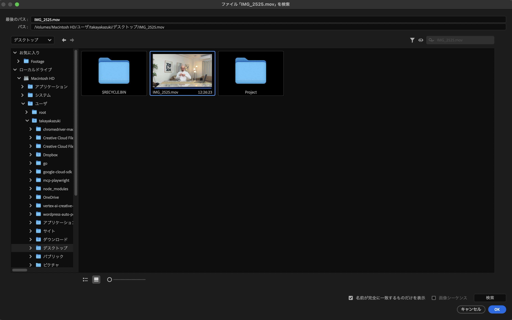

# 【画像付き】Premiere Pro EDL読み込みガイド

## EDLファイルの読み込み手順

### 1. ファイル → 読み込み
メニューから「ファイル」→「読み込み」を選択します。

### 2. EDLファイルを選択
生成されたEDLファイルを選択して「開く」をクリック。

### 3. PALを選択
EDL情報ダイアログが表示されたら：
- **PAL**を選択（重要！）
- シーケンス名を**案件名**に変更すると管理しやすい
- 「OK」をクリック

### 4. オフラインメディアの確認
読み込み後、プロジェクトパネルに「？」マークのついたオフラインクリップが表示されます。
これは素材とのリンクが切れている状態です。

### 5. オフラインメディアを全選択
- **Shiftキー**を押しながらクリックして、すべてのオフラインクリップを選択

### 6. メディアをリンク
- 選択した状態で**右クリック**
- 「**メディアをリンク**」を選択

### 7. 素材を検索
メディアをリンクダイアログが表示されたら：
- 「**検索**」ボタンをクリック
- 元の動画ファイルを選択
- 「OK」をクリック

### 8. リンク完了の確認
- 「？」マークが消えて、サムネイルが表示されれば成功！
- すべてのクリップが正常にリンクされました

### 9. シーケンスを開く
リンクが完了したら、シーケンスをダブルクリックして開きます。
無音部分がカットされた状態でタイムラインに表示されます。

## ⚠️ 重要な注意点
- EDLによるカットは完全ではありません
- **必ず再生しながら微調整**してください
- カットポイントがずれている場合は手動で調整

### タイムラインの隙間について
EDLでカットすると、このように一部で隙間ができてしまうことがあります：

これは正常な動作です。必要に応じて手動で調整してください。

---

これでEDLの読み込みは完了です！🎉